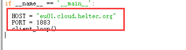

# MQTT 订阅快速入门

## 摘要

MQTT是一种基于TCP/IP的发布/预订协议，可以连接大量的远程传感器和控制设备，是轻量级的消息订阅和发布协议。

```Tip:: 本例使用的是MQTT.fx 1.7.1 和Python 3.8.5

```

## 使用MQTT.fx订阅消息

[下载 MQTT.fx](http://mqttfx.jensd.de/index.php/download) 

### MQTT接入Cloud Server

点击如下所示的按钮配置连接信息。


输入下面所需要的配置信息，其中 ``Broker Address`` 即为 [所选频段](https://cloud-platform-docs-zh-cn.readthedocs.io/zh/latest/quick_start.html#id3) 所对应的服务器地址，端口号默认 ``1883`` ，选择 ``User Credentials`` 输入[账号和密码](https://cloud-platform-docs-zh-cn.readthedocs.io/zh/latest/quick_start.html#id2)，点击 ``OK`` （**注：账号目前只支持用户名格式，不支持邮箱格式**）。


点击 ``Connect`` 连接到服务器。连接成功后将会在右面显示为绿色状态。


### 订阅消息

依次点击 ``Subscribe`` -> ``scan`` ,等待接入的 ``节点`` 传输数据。


当有 ``节点`` 上传数据后，将会在 ``scan`` 栏扫描到信息。


选中一个作为你的订阅信息，当有和你匹配的订阅信息上传时，将会显示在数据栏。以下示例订阅的是  ``application/4/device/22........09/rx`` 


## 使用Python脚本订阅MQTT

[下载 pyhton](https://www.python.org/downloads/) 后需要在终端中输入 ``pip install paho-mqtt python-etcd`` 安装模块

### 信息配置

将如下数据修改成接入 [Cloud Server](http://cloud.heltec.org) 的 [账号和密码](https://cloud-platform-docs-zh-cn.readthedocs.io/zh/latest/quick_start.html#id2) 。


将如下数据修改成想要订阅的内容。


将HOST修改为所选频段的服务器地址，端口号默认1883。



### 运行python脚本


