# Cloud Server 快速入门

[English](https://cloud-platform-docs.readthedocs.io/en/latest/quick_start.html)

## 摘要

Cloud Server 是一个简单且功能齐全的LoRa云服务器，本页面展示了如何快速使用这个云服务器。

## 创建基础配置

### 登录/注册

打开 ``浏览器`` 输入网址 [http://cloud.heltec.org](http://cloud.heltc.org)，你将会看到以下界面，点击 ``Register/Login`` 。

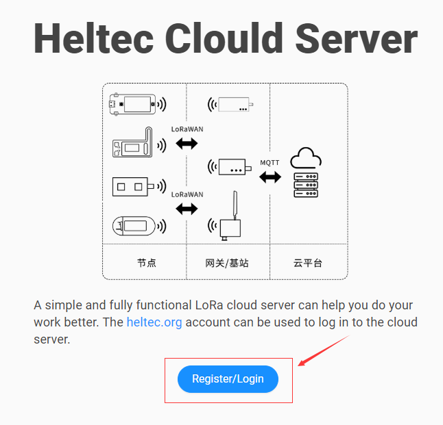

如果已有[heltec.org](https://heltec.org)的账号可以直接输入正确的用户名和密码，点击 ``LOG IN`` 。若没有账号，需要先注册，输入你想要展示的用户名，邮件地址和密码，点击 ``REGISTER`` 完成注册，就可以成功登录。

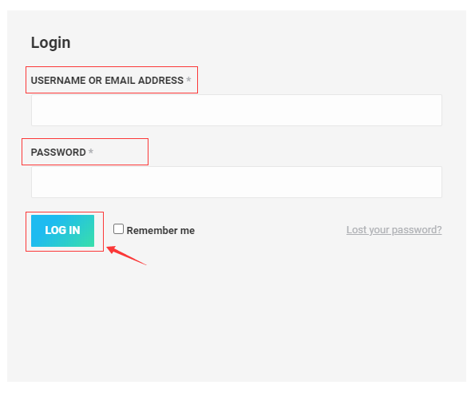

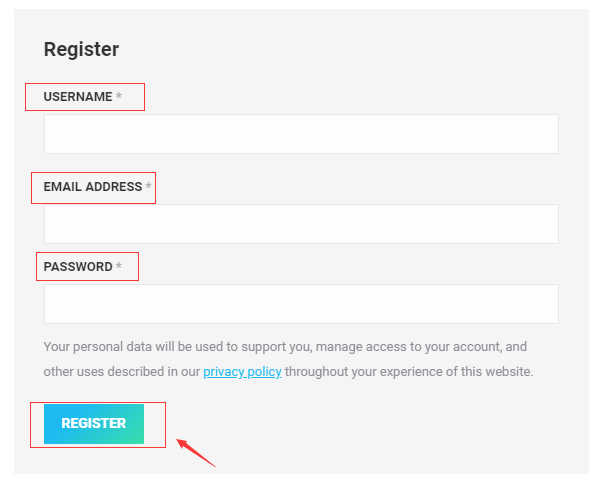

### 选择频段

进入平台后，选择你所需要的区域频段，如 ``AS923`` 。

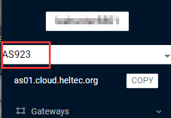

### 创建网关

依次点击 ``Gateways``->``GatewaysCreate`` 后，在出现的界面中选择 ``GENERAL`` 菜单，填写相应的信息，下面三个选项为必填项，其余选项为可选项，最后滑动到页面最下方，点击 ``CREATE GATEWAY`` 完成网关创建。如下示例。

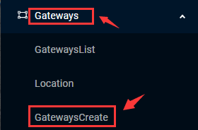

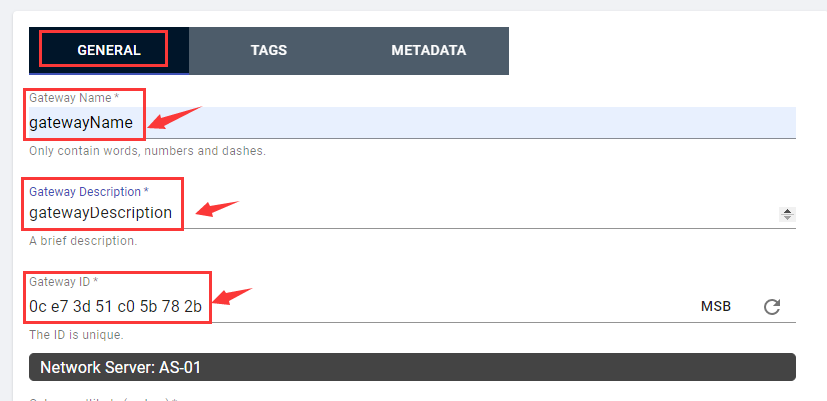

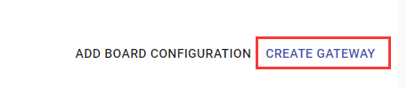

### 创建应用

依次点击 ``Apps``->``AppsCreate`` 后，在出现的界面中填写相应的信息，下面两个选项为必填项，其余选项为可选项，点击 ``CREATE APPLICATION`` 完成创建。如下示例。

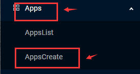

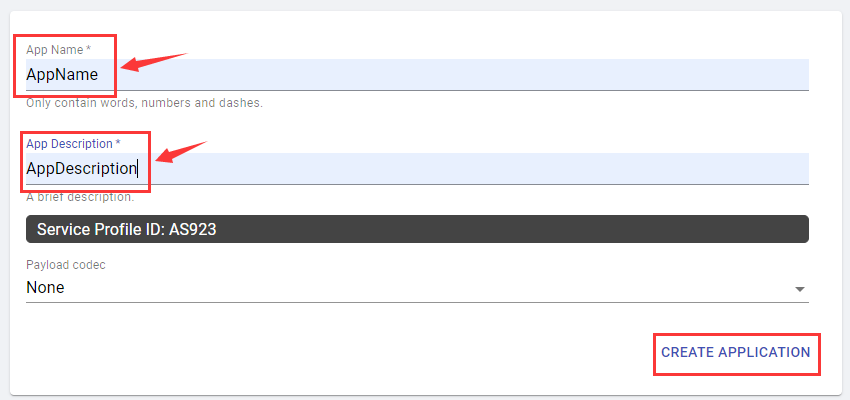

### 创建节点

依次点击 ``Apps``->``AppsList`` 后，会看到之前我们创建好的应用（示例中的``AppName``），点击它。

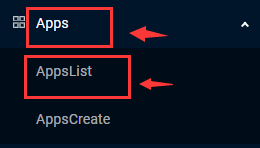

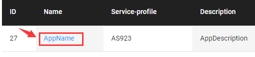

在出现的界面中选择 ``DEVICES`` 菜单，点击 ``CREATE`` 创建节点。

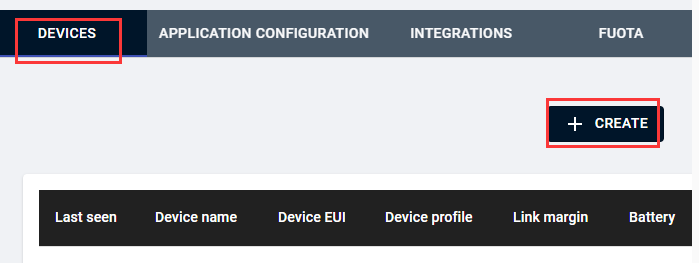

选择``GENERAL`` 菜单，填写相应的信息，下面四个选项为必填项，其余选项为可选项，点击 ``CREATE DEVICE`` 。

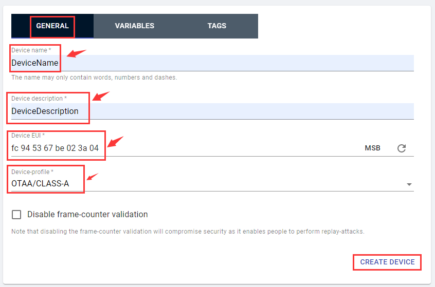

根据所选择的 ``Device-profile``选项，填写你所需要的 ``Key`` 或者 ``LoRa 协议`` 等信息。例如，本次示例选择 ``Device-profile`` 为 ``OTAA/CLASS-A`` 如下所示：

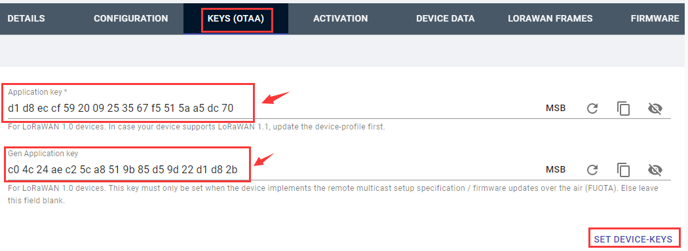
